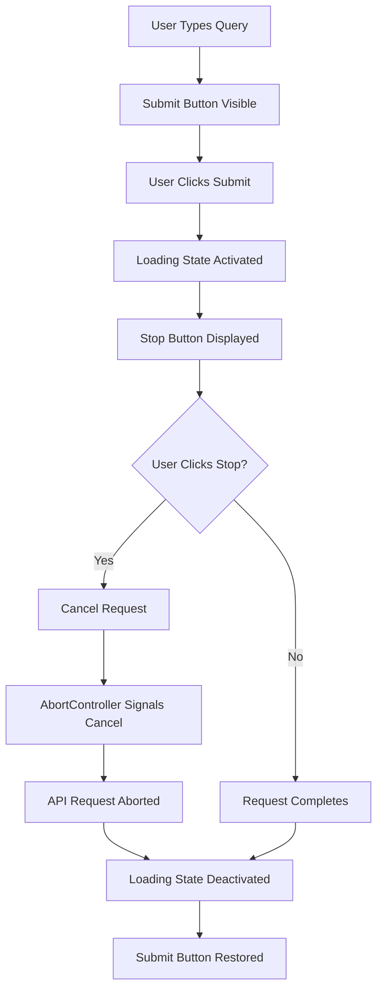
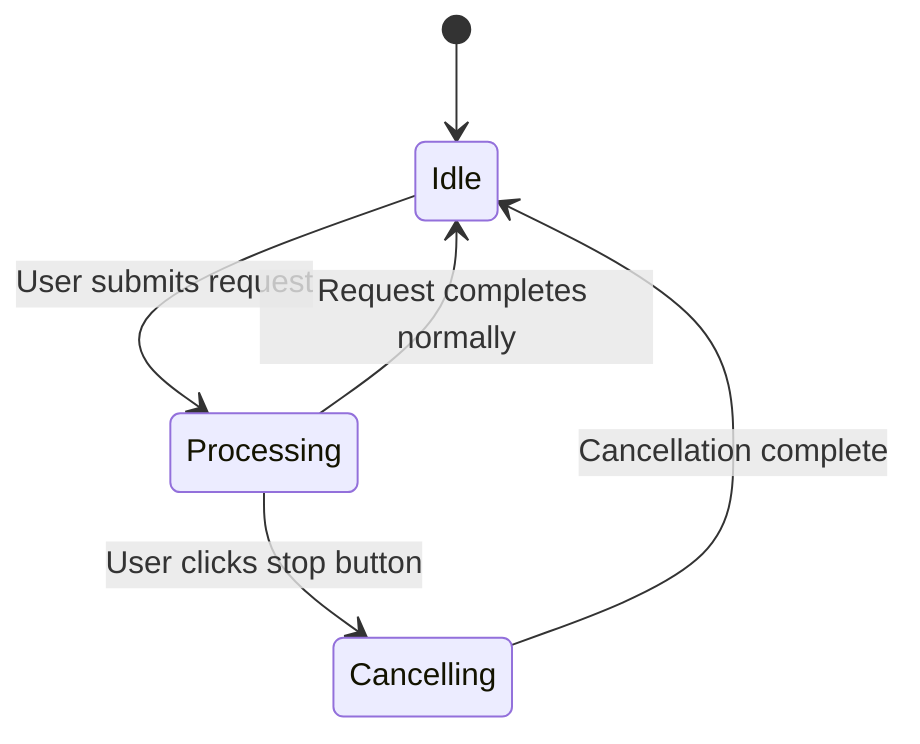

# Input Submission Control Design Document

## 1. Overview

This document outlines the design for implementing a stop button functionality in the ESI-ADV application. The feature will transform the submission button into a stop button when the agent is processing a request, allowing users to cancel ongoing requests.

### Problem Statement
Currently, when a user submits a query to the agent, there is no way to cancel the request if it's taking too long or if the user changes their mind. This can lead to a poor user experience, especially for long-running requests.

### Solution
Implement a mechanism to:
1. Show a stop button when the agent is processing
2. Allow users to cancel ongoing requests
3. Provide visual feedback during the cancellation process

## 2. Architecture

### 2.1 Component Interaction

The solution involves modifications to the following components:

1. **Main Component** (`src/components/Main/Main.jsx`):
   - Manage the state of the submission/stop button
   - Handle user interactions with the stop button
   - Display appropriate button based on agent state

2. **Context Provider** (`src/context/Context.jsx`):
   - Implement cancellation mechanism
   - Manage the abort controller for API requests
   - Handle cleanup after cancellation

3. **API Client** (`src/config/gemini.js`):
   - Support request cancellation through AbortController
   - Handle cancellation errors gracefully

### 2.2 Data Flow



## 3. Implementation Details

### 3.1 Frontend Changes

#### Main Component Modifications

1. Add state to track if a request can be cancelled:
   ```javascript
   const [canCancel, setCanCancel] = useState(false);
   ```

2. Add cancel function:
   ```javascript
   const cancelRequest = () => {
     // Call context function to cancel request
     cancelCurrentRequest();
   };
   ```

3. Modify the input box rendering logic:
   ```jsx
   {input || fileInputRef.current?.files?.length > 0 ? (
     canCancel ? (
       
     ) : (
        {
           onSent(input, fileInputRef.current?.files[0]);
         }} 
         src={assets.send_icon} 
         alt="Send" 
       />
     )
   ) : null}
   ```

#### Context Provider Modifications

1. Add AbortController to manage cancellation:
   ```javascript
   const [abortController, setAbortController] = useState(null);
   ```

2. Modify `onSent` function to create and use AbortController:
   ```javascript
   const onSent = async (prompt, file = null) => {
     // Create AbortController for this request
     const controller = new AbortController();
     setAbortController(controller);
     setCanCancel(true);
     
     
     try {
       // Pass signal to streaming function
       await streamChatWithHistory(
         historyForApi, 
         { verbosity, temperature, model }, 
         file, 
         onDelta,
         controller.signal
       );
     } catch (error) {
       if (error.name === 'AbortError') {
         // Handle cancellation
         console.log('Request was cancelled');
         setLoading(false);
         setCanCancel(false);
       }
     } finally {
       setAbortController(null);
       setCanCancel(false);
     }
   };
   ```

3. Add cancellation function:
   ```javascript
   const cancelCurrentRequest = () => {
     if (abortController) {
       abortController.abort();
       setAbortController(null);
       setCanCancel(false);
     }
   };
   ```

4. Provide the cancellation function through context:
   ```javascript
   const contextValue = {
     // ... existing values ...
     cancelCurrentRequest,
     canCancel
   };
   ```

#### API Client Modifications

1. Modify `streamChatWithHistory` to accept and use AbortSignal:
   ```javascript
   export async function streamChatWithHistory(
     messages, 
     options = {}, 
     file = null, 
     onDelta, 
     signal = null
   ) {
     try {
       const payload = new FormData();
       
       const response = await fetch(`${BACKEND_URL}/chat/stream`, {
         method: 'POST',
         body: payload,
         signal: signal // Add abort signal
       });
       
       // ... rest of existing code ...
     } catch (error) {
       if (error.name === 'AbortError') {
         // Re-throw abort errors so they can be handled upstream
         throw error;
       }
       // ... existing error handling ...
     }
   }
   ```

### 3.2 Backend Changes

The backend currently uses a synchronous agent execution approach that doesn't easily support cancellation. To properly implement cancellation, we would need to:

1. Modify the agent execution to be cancellable
2. Add support for checking cancellation signals during long operations

However, since the current implementation uses `await asyncio.to_thread(agent_local.invoke, payload)` which runs the agent in a separate thread, true cancellation is complex. For now, we'll implement client-side cancellation which will:

1. Abort the HTTP request
2. Stop processing the stream on the frontend
3. Leave the backend request running (it will complete but results will be ignored)

### 3.3 UI/UX Considerations

1. **Visual Design**:
   - Use a distinct stop icon to differentiate from the send icon
   - Add hover effects to indicate interactivity
   - Maintain consistent sizing with the send button

2. **Feedback**:
   - Show immediate visual feedback when stop button is clicked
   - Display a brief message indicating cancellation is in progress
   - Restore normal state after cancellation completes

3. **Accessibility**:
   - Ensure proper ARIA labels for screen readers
   - Maintain keyboard navigation support
   - Provide clear focus states

## 4. State Management

### 4.1 New State Variables

| State Variable | Type | Purpose |
|----------------|------|---------|
| `canCancel` | Boolean | Indicates if a request can be cancelled |
| `abortController` | AbortController | Manages request cancellation |

### 4.2 State Transitions



## 5. Error Handling

### 5.1 Abort Errors
- Handle `AbortError` exceptions specifically
- Clean up state properly after cancellation
- Prevent memory leaks from unfinished operations

### 5.2 Network Errors
- Distinguish between cancellation and network failures
- Provide appropriate user feedback
- Allow retrying cancelled requests

### 5.3 Backend State
- Backend requests may continue running after client cancellation
- Implement cleanup mechanisms to prevent resource waste
- Consider adding explicit cancellation endpoints in future

## 6. Testing Strategy

### 6.1 Unit Tests
1. Test button state transitions (send → stop → send)
2. Test cancellation function behavior
3. Test AbortController integration
4. Test error handling for aborted requests

### 6.2 Integration Tests
1. Test complete flow from submission to cancellation
2. Test cancellation during different phases of request processing
3. Test UI state updates during cancellation

### 6.3 Manual Testing
1. Verify visual appearance of stop button
2. Test responsiveness of stop button
3. Confirm proper state restoration after cancellation
4. Validate behavior with different request types (with/without files)

## 7. Performance Considerations

1. **Memory Management**:
   - Properly dispose of AbortController instances
   - Clean up event listeners to prevent memory leaks

2. **Network Efficiency**:
   - Early termination of HTTP requests saves bandwidth
   - Reduces load on backend services

3. **UI Responsiveness**:
   - Immediate visual feedback for stop button clicks
   - Non-blocking cancellation operations

## 8. Security Considerations

1. No additional security risks introduced by this feature
2. Existing authentication and authorization mechanisms remain unchanged
3. Cancellation does not expose any sensitive information

## 9. Future Enhancements

1. **Backend Cancellation**:
   - Implement proper backend request cancellation
   - Add explicit cancellation endpoints

2. **Enhanced Feedback**:
   - Progress indicators during cancellation
   - Estimated time for cancellation completion

3. **Batch Operations**:
   - Support for cancelling multiple requests
   - Cancellation queue management