# LLM Model Selector Feature Design

## Overview

This document outlines the design for adding an LLM model selector to the settings panel, allowing users to choose between different Gemini models and OpenRouter models. The feature will enable dynamic model switching without requiring application restart.

## Architecture

### Component Architecture

The LLM model selector will integrate into the existing settings infrastructure:


### Data Flow

1. User selects model from dropdown in SettingsPanel
2. Context updates selectedModel state and persists to localStorage
3. API calls include model parameter in options payload
4. Backend creates appropriate LLM instance based on model prefix
5. Agent uses the selected model for all subsequent operations

## Component Hierarchy

### Settings Panel Component Enhancement


## State Management Implementation

### Context.jsx State Extension

The existing Context will be extended to include model management:

| State Variable | Type | Default | Description |
|----------------|------|---------|-------------|
| `selectedModel` | string | "gemini-2.5-flash" | Currently selected LLM model |
| `setSelectedModel` | function | - | State setter for model selection |
| `modelCategories` | object | predefined | Organized model definitions |

### Model Configuration Structure

```javascript
const MODEL_CATEGORIES = {
  gemini: {
    label: "Google Gemini",
    models: [
      { id: "gemini-2.5-flash", name: "Gemini 2.5 Flash", description: "Fast, balanced performance" },
      { id: "gemini-2.5-pro", name: "Gemini 2.5 Pro", description: "Advanced capabilities" },
      { id: "gemini-2.5-flash-exp", name: "Gemini 2.5 Flash Experimental", description: "Latest experimental features" }
    ]
  },
  openrouter: {
    label: "OpenRouter Models",
    models: [
      { id: "mistralai/mistral-small", name: "Mistral Small", description: "Efficient, cost-effective" },
      { id: "mistralai/mistral-large", name: "Mistral Large", description: "High performance" },
      { id: "anthropic/claude-3.5-sonnet", name: "Claude 3.5 Sonnet", description: "Advanced reasoning" },
      { id: "openai/gpt-4o", name: "GPT-4o", description: "Latest OpenAI model" }
    ]
  }
}
```

## UI Components

### Model Selector Dropdown Design

The model selector will be implemented as a grouped dropdown with the following structure:

```mermaid
graph TB
    Dropdown[Model Selector Dropdown]
    
    Dropdown --> Header1[📡 Google Gemini]
    Header1 --> Option1[⚡ Gemini 2.5 Flash]
    Header1 --> Option2[🧠 Gemini 2.5 Pro]
    Header1 --> Option3[🧪 Gemini 2.5 Flash Exp]
    
    Dropdown --> Divider1[---]
    
    Dropdown --> Header2[🌐 OpenRouter Models]
    Header2 --> Option4[🔥 Mistral Small]
    Header2 --> Option5[⚔️ Mistral Large]
    Header2 --> Option6[🎭 Claude 3.5 Sonnet]
    Header2 --> Option7[🚀 GPT-4o]
```



### Settings Panel Layout Update

The model selector will be positioned after the existing sliders:

| Component | Position | Description |
|-----------|----------|-------------|
| Dark Mode Toggle | 1 | Existing toggle |
| Verbosity Slider | 2 | Existing slider |
| Temperature Slider | 3 | Existing slider |
| **Model Selector** | **4** | **New dropdown component** |

## API Integration

### Frontend API Client Updates

The `gemini.js` API client will pass the selected model in the options payload:

```javascript
export async function runChatWithHistory(messages, options = {}, file = null) {
  const payload = new FormData();
  
  // Include selectedModel from context
  const enhancedOptions = {
    ...options,
    model: options.model || getSelectedModel() // From context
  };
  
  payload.append('options', JSON.stringify(enhancedOptions));
  // ... rest of implementation
}
```

### Backend Model Selection Logic

The existing backend logic already supports model selection through the options parameter. The `create_agent` function will receive the model parameter and instantiate the appropriate LLM:

```python
# In main.py chat endpoint
model = options_data.get("model") or "gemini-2.5-flash"

# In agent.py create_agent function
if model.startswith("gemini"):
    llm = ChatGoogleGenerativeAI(model=model, ...)
else:
    llm = ChatOpenAI(model=model, base_url="https://openrouter.ai/api/v1", ...)
```

## Configuration Management

### Environment Variables

The following environment variables are required for full functionality:

| Variable | Purpose | Required For |
|----------|---------|--------------|
| `GOOGLE_API_KEY` | Google Gemini models | Gemini models |
| `OPENROUTER_API_KEY` | OpenRouter models | OpenRouter models |
| `TAVILY_API_KEY` | Web search functionality | All models |

### Model Validation

The frontend will validate model availability based on environment configuration:


## User Experience Design

### Model Selection Flow

1. **Settings Access**: User opens settings panel via sidebar or settings button
2. **Model Discovery**: User sees organized dropdown with available models
3. **Model Selection**: User selects desired model from grouped options
4. **Immediate Feedback**: UI shows selected model with description
5. **Persistence**: Selection is saved to localStorage and user preferences
6. **Next Interaction**: All subsequent chat interactions use selected model

### Error Handling

| Error Scenario | User Experience | Resolution |
|----------------|-----------------|------------|
| Missing API Key | Disable unavailable models, show tooltip | User configures environment |
| Invalid Model ID | Fallback to default model | Silent fallback with logging |
| Network Error | Show temporary error state | Retry mechanism |
| Model Not Supported | Gray out option with explanation | Contact support |

## Data Persistence

### Local Storage Schema

```javascript
{
  "selectedModel": "gemini-2.5-flash",
  "modelPreferences": {
    "lastUsed": "2024-01-01T00:00:00Z",
    "favoriteModels": ["gemini-2.5-flash", "claude-3.5-sonnet"]
  }
}
```

### Supabase Integration

For authenticated users, model preferences will be stored in user profiles:

```sql
-- User preferences table extension
ALTER TABLE user_preferences ADD COLUMN selected_model VARCHAR(100) DEFAULT 'gemini-2.5-flash';
ALTER TABLE user_preferences ADD COLUMN model_preferences JSONB DEFAULT '{}';
```

## Testing Strategy

### Component Testing

- **Model Selector Component**: Dropdown rendering, option selection, grouping
- **Context Integration**: State management, persistence, API parameter passing
- **Settings Panel**: Layout integration, visual consistency

### Integration Testing

- **API Parameter Flow**: Frontend selection → Backend model instantiation
- **Model Switching**: Runtime model changes without restart
- **Error Scenarios**: Missing API keys, invalid models, network failures

### User Acceptance Testing

- **Model Discovery**: Users can find and understand available models
- **Selection Process**: Intuitive model selection and confirmation
- **Performance Impact**: Model switching doesn't affect user experience

## Responsive Design Considerations

### Mobile Layout

The model selector will adapt to smaller screens:

- Dropdown remains accessible on mobile devices
- Model descriptions truncate appropriately
- Touch-friendly interaction targets
- Consistent with existing mobile settings UI

### Accessibility

- Proper ARIA labels for screen readers
- Keyboard navigation support
- High contrast mode compatibility
- Descriptive option text for assistive technologies

## Performance Considerations

### Lazy Loading

Model definitions will be loaded efficiently:

- Static model configuration embedded in bundle
- Dynamic API key validation on component mount
- Minimal re-renders on model selection

### Caching Strategy

- Model capabilities cached in localStorage
- API key validation results cached temporarily
- Selected model persisted across sessions

## Security Implications

### API Key Management

- Frontend never exposes actual API keys
- Backend validates API key availability without exposure
- Model selection limited to configured providers

### Input Validation

- Model IDs validated against known model list
- Fallback to default model for invalid selections
- Sanitization of user-provided model preferences