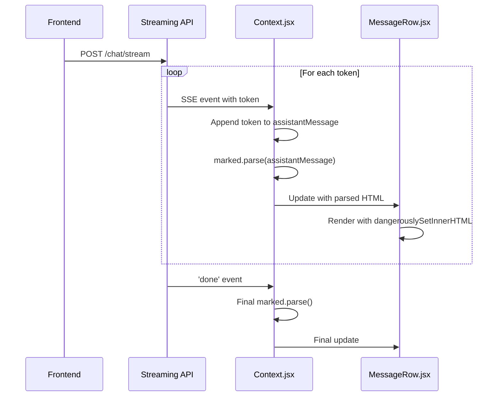
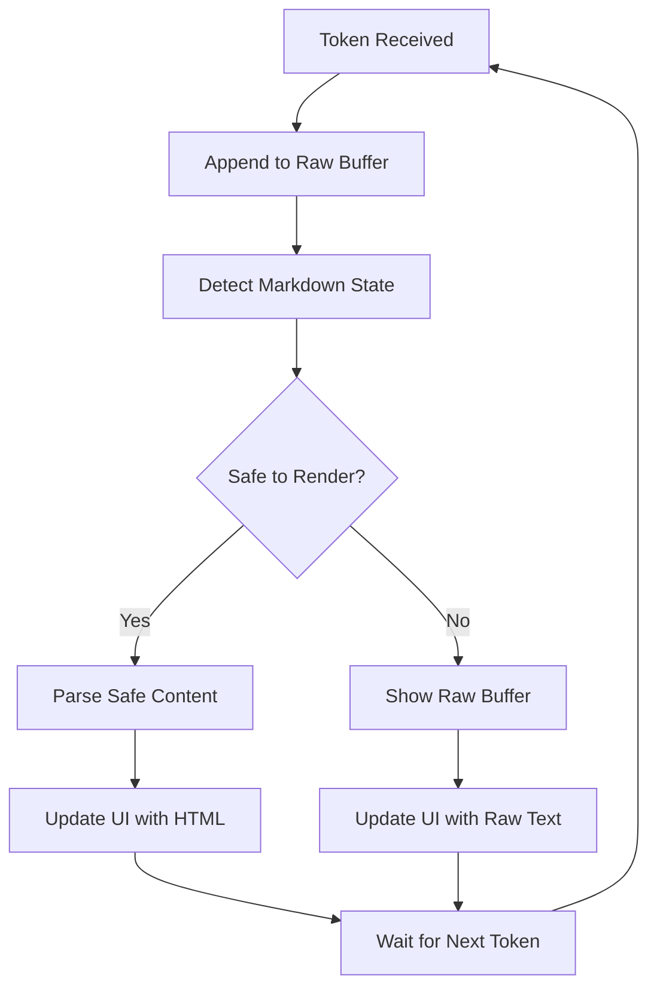
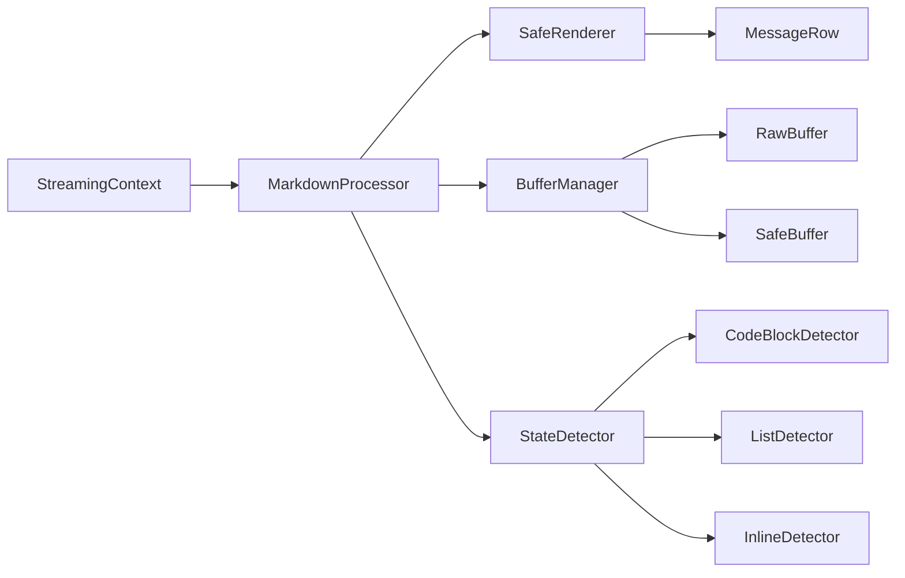
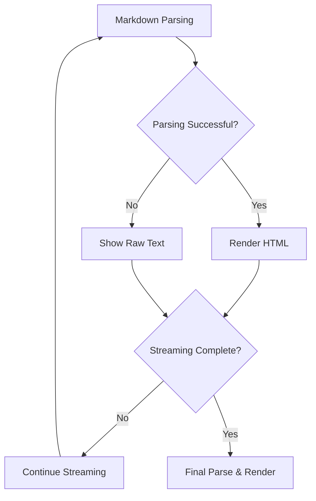

# Markdown Stream Formatter - Design Document

## Overview

The current streaming implementation has markdown formatting issues where streamed responses are not rendered correctly. The problem occurs because markdown content is parsed incrementally during streaming, causing incomplete markdown structures to be rendered incorrectly until the full content is received.

## Current Architecture Analysis

### Current Streaming Flow


### Current Issues Identified

1. **Incremental Parsing Problems**: Each token appends to the message and triggers a full `marked.parse()`, causing:
   - Incomplete markdown syntax to render incorrectly
   - Code blocks to break during streaming
   - Lists and headers to appear malformed
   - Performance issues from repeated parsing

2. **Incomplete Markdown Structures**: During streaming:
   - `**bold tex` renders as `**bold tex` instead of waiting for closing `**`
   - Code blocks ` ```python\nprint("hello"` render as text instead of code
   - Lists that are partially streamed show raw markdown

3. **No Buffering Strategy**: The system doesn't differentiate between:
   - Safe-to-render partial content
   - Incomplete markdown that should wait for completion

## Architecture Design

### Markdown Buffer Strategy


### Component Architecture


## Implementation Strategy

### 1. Markdown Buffer Manager

Create a markdown buffer management system that:
- Maintains raw text buffer
- Tracks markdown parsing state
- Determines safe rendering boundaries
- Handles incomplete markdown gracefully

```javascript
class MarkdownBufferManager {
  constructor() {
    this.rawBuffer = '';
    this.safeBuffer = '';
    this.pendingMarkdown = '';
    this.inCodeBlock = false;
    this.inInlineCode = false;
    this.codeBlockDepth = 0;
  }
  
  addToken(token) {
    this.rawBuffer += token;
    this.updateSafeBuffer();
    return this.getSafeContent();
  }
  
  updateSafeBuffer() {
    // Detect markdown boundaries and update safe buffer
  }
  
  getSafeContent() {
    // Return content safe for rendering
  }
}
```

### 2. Markdown State Detection

Implement state detection for various markdown elements:

```javascript
class MarkdownStateDetector {
  detectCodeBlocks(content) {
    // Detect ``` code block boundaries
  }
  
  detectInlineCode(content) {
    // Detect ` inline code boundaries
  }
  
  detectInlineFormatting(content) {
    // Detect **bold**, *italic*, etc.
  }
  
  detectLists(content) {
    // Detect list item boundaries
  }
  
  isSafeToRender(content) {
    // Determine if content can be safely parsed
  }
}
```

### 3. Safe Rendering Strategy

#### Strategy A: Progressive Safe Parsing
- Parse only complete markdown structures
- Keep incomplete structures as raw text
- Gradually convert raw text to HTML as structures complete

#### Strategy B: Dual Buffer Approach
- Maintain both raw and parsed buffers
- Show raw text for incomplete structures
- Switch to parsed HTML when structures complete

#### Strategy C: Markdown-Aware Chunking
- Buffer content until markdown boundaries
- Parse complete sections progressively
- Handle mixed content gracefully

### 4. Fallback Mechanisms



## Data Flow Architecture

### Enhanced Streaming Context
```javascript
// Enhanced streaming handler in Context.jsx
const onDelta = (data) => {
  switch (data.type) {
    case 'delta':
      const safeContent = markdownBuffer.addToken(data.text);
      updateMessageWithContent(safeContent);
      break;
    case 'done':
      const finalContent = markdownBuffer.finalize();
      updateMessageWithContent(finalContent, true);
      break;
  }
};
```

### MessageRow Component Enhancement
```javascript
// Enhanced MessageRow.jsx
const MessageRow = ({ m, idx, assets, onEdit, loading }) => {
  const renderContent = () => {
    if (m.isStreaming && m.rawContent) {
      return <StreamingMarkdownRenderer content={m.rawContent} />;
    }
    return <span dangerouslySetInnerHTML={{ __html: m.content }} />;
  };
  
  return (
    <div className={`msg-row ${m.role}`}>
      {/* ... existing code ... */}
      {renderContent()}
      {/* ... existing code ... */}
    </div>
  );
};
```

## Component Specifications

### MarkdownBufferManager Class
```javascript
interface MarkdownBufferManager {
  rawBuffer: string;
  safeBuffer: string;
  markdownState: MarkdownState;
  
  addToken(token: string): SafeContent;
  finalize(): string;
  reset(): void;
}
```

### StreamingMarkdownRenderer Component
```javascript
interface StreamingMarkdownRendererProps {
  content: string;
  isComplete: boolean;
  onRenderUpdate?: (html: string) => void;
}
```

### MarkdownStateDetector Utility
```javascript
interface MarkdownStateDetector {
  detectState(content: string): MarkdownState;
  isSafeToRender(content: string): boolean;
  findSafeBoundary(content: string): number;
}
```

## Testing Strategy

### Unit Testing
1. **Buffer Management Tests**
   - Token addition and buffer updates
   - State detection accuracy
   - Safe boundary detection

2. **Markdown Parsing Tests**
   - Complete structure parsing
   - Incomplete structure handling
   - Mixed content scenarios

3. **Rendering Tests**
   - Safe content rendering
   - Fallback scenarios
   - Performance benchmarks

### Integration Testing
1. **Streaming Integration**
   - End-to-end streaming flow
   - Error handling and recovery
   - Performance under load

2. **UI Rendering Tests**
   - Visual regression testing
   - Cross-browser compatibility
   - Accessibility compliance

### Edge Case Testing
1. **Malformed Markdown**
   - Unclosed code blocks
   - Nested formatting conflicts
   - Invalid syntax handling

2. **Performance Testing**
   - Large content streaming
   - Rapid token updates
   - Memory usage optimization

## Implementation Phases

### Phase 1: Core Infrastructure
- Create MarkdownBufferManager class
- Implement basic state detection
- Add safe boundary detection logic

### Phase 2: Integration
- Integrate buffer manager into Context.jsx
- Update streaming delta handler
- Modify MessageRow component

### Phase 3: Enhancement
- Add advanced markdown detection
- Implement performance optimizations
- Add comprehensive error handling

### Phase 4: Testing & Optimization
- Comprehensive testing suite
- Performance benchmarking
- Cross-browser validation

## Deployment Considerations

### Backward Compatibility
- Maintain existing API interface
- Graceful degradation for unsupported scenarios
- Preserve existing functionality

### Performance Impact
- Minimize computational overhead during streaming
- Optimize memory usage for large responses
- Consider Web Worker for heavy processing

### Error Handling
- Robust fallback to raw text rendering
- Graceful handling of malformed markdown
- Comprehensive logging for debugging

## Expected Outcomes

### User Experience Improvements
- Smooth, properly formatted markdown during streaming
- No visual artifacts from incomplete markdown
- Responsive interface during content generation

### Technical Benefits
- Cleaner, more maintainable streaming code
- Better separation of concerns
- Enhanced debugging capabilities

### Performance Gains
- Reduced unnecessary re-parsing
- Optimized rendering cycles
- Better memory management    participant Frontend as Frontend
    participant API as Streaming API
    participant Context as Context.jsx
    participant UI as MessageRow.jsx
    
    Frontend->>API: POST /chat/stream
    loop For each token
        API->>Context: SSE event with token
        Context->>Context: Append token to assistantMessage
        Context->>Context: marked.parse(assistantMessage)
        Context->>UI: Update with parsed HTML
        UI->>UI: Render with dangerouslySetInnerHTML
    end
    API->>Context: 'done' event
    Context->>Context: Final marked.parse()
    Context->>UI: Final update
```

### Current Issues Identified

1. **Incremental Parsing Problems**: Each token appends to the message and triggers a full `marked.parse()`, causing:
   - Incomplete markdown syntax to render incorrectly
   - Code blocks to break during streaming
   - Lists and headers to appear malformed
   - Performance issues from repeated parsing

2. **Incomplete Markdown Structures**: During streaming:
   - `**bold tex` renders as `**bold tex` instead of waiting for closing `**`
   - Code blocks ` ```python
print("hello"` render as text instead of code
   - Lists that are partially streamed show raw markdown

3. **No Buffering Strategy**: The system doesn't differentiate between:
   - Safe-to-render partial content
   - Incomplete markdown that should wait for completion

## Architecture Design

### Markdown Buffer Strategy


### Component Architecture


## Implementation Strategy

### 1. Markdown Buffer Manager

Create a markdown buffer management system that:
- Maintains raw text buffer
- Tracks markdown parsing state
- Determines safe rendering boundaries
- Handles incomplete markdown gracefully

```javascript
class MarkdownBufferManager {
  constructor() {
    this.rawBuffer = '';
    this.safeBuffer = '';
    this.pendingMarkdown = '';
    this.inCodeBlock = false;
    this.inInlineCode = false;
    this.codeBlockDepth = 0;
  }
  
  addToken(token) {
    this.rawBuffer += token;
    this.updateSafeBuffer();
    return this.getSafeContent();
  }
  
  updateSafeBuffer() {
    // Detect markdown boundaries and update safe buffer
  }
  
  getSafeContent() {
    // Return content safe for rendering
  }
}
```

### 2. Markdown State Detection

Implement state detection for various markdown elements:

```javascript
class MarkdownStateDetector {
  detectCodeBlocks(content) {
    // Detect ``` code block boundaries
  }
  
  detectInlineCode(content) {
    // Detect ` inline code boundaries
  }
  
  detectInlineFormatting(content) {
    // Detect **bold**, *italic*, etc.
  }
  
  detectLists(content) {
    // Detect list item boundaries
  }
  
  isSafeToRender(content) {
    // Determine if content can be safely parsed
  }
}
```

### 3. Safe Rendering Strategy

#### Strategy A: Progressive Safe Parsing
- Parse only complete markdown structures
- Keep incomplete structures as raw text
- Gradually convert raw text to HTML as structures complete

#### Strategy B: Dual Buffer Approach
- Maintain both raw and parsed buffers
- Show raw text for incomplete structures
- Switch to parsed HTML when structures complete

#### Strategy C: Markdown-Aware Chunking
- Buffer content until markdown boundaries
- Parse complete sections progressively
- Handle mixed content gracefully

### 4. Fallback Mechanisms


## Data Flow Architecture

### Enhanced Streaming Context
```javascript
// Enhanced streaming handler in Context.jsx
const onDelta = (data) => {
  switch (data.type) {
    case 'delta':
      const safeContent = markdownBuffer.addToken(data.text);
      updateMessageWithContent(safeContent);
      break;
    case 'done':
      const finalContent = markdownBuffer.finalize();
      updateMessageWithContent(finalContent, true);
      break;
  }
};
```

### MessageRow Component Enhancement
```javascript
// Enhanced MessageRow.jsx
const MessageRow = ({ m, idx, assets, onEdit, loading }) => {
  const renderContent = () => {
    if (m.isStreaming && m.rawContent) {
      return <StreamingMarkdownRenderer content={m.rawContent} />;
    }
    return <span dangerouslySetInnerHTML={{ __html: m.content }} />;
  };
  
  return (
    <div className={`msg-row ${m.role}`}>
      {/* ... existing code ... */}
      {renderContent()}
      {/* ... existing code ... */}
    </div>
  );
};
```

## Component Specifications

### MarkdownBufferManager Class
```javascript
interface MarkdownBufferManager {
  rawBuffer: string;
  safeBuffer: string;
  markdownState: MarkdownState;
  
  addToken(token: string): SafeContent;
  finalize(): string;
  reset(): void;
}
```

### StreamingMarkdownRenderer Component
```javascript
interface StreamingMarkdownRendererProps {
  content: string;
  isComplete: boolean;
  onRenderUpdate?: (html: string) => void;
}
```

### MarkdownStateDetector Utility
```javascript
interface MarkdownStateDetector {
  detectState(content: string): MarkdownState;
  isSafeToRender(content: string): boolean;
  findSafeBoundary(content: string): number;
}
```

## Testing Strategy

### Unit Testing
1. **Buffer Management Tests**
   - Token addition and buffer updates
   - State detection accuracy
   - Safe boundary detection

2. **Markdown Parsing Tests**
   - Complete structure parsing
   - Incomplete structure handling
   - Mixed content scenarios

3. **Rendering Tests**
   - Safe content rendering
   - Fallback scenarios
   - Performance benchmarks

### Integration Testing
1. **Streaming Integration**
   - End-to-end streaming flow
   - Error handling and recovery
   - Performance under load

2. **UI Rendering Tests**
   - Visual regression testing
   - Cross-browser compatibility
   - Accessibility compliance

### Edge Case Testing
1. **Malformed Markdown**
   - Unclosed code blocks
   - Nested formatting conflicts
   - Invalid syntax handling

2. **Performance Testing**
   - Large content streaming
   - Rapid token updates
   - Memory usage optimization

## Implementation Phases

### Phase 1: Core Infrastructure
- Create MarkdownBufferManager class
- Implement basic state detection
- Add safe boundary detection logic

### Phase 2: Integration
- Integrate buffer manager into Context.jsx
- Update streaming delta handler
- Modify MessageRow component

### Phase 3: Enhancement
- Add advanced markdown detection
- Implement performance optimizations
- Add comprehensive error handling

### Phase 4: Testing & Optimization
- Comprehensive testing suite
- Performance benchmarking
- Cross-browser validation

## Deployment Considerations

### Backward Compatibility
- Maintain existing API interface
- Graceful degradation for unsupported scenarios
- Preserve existing functionality

### Performance Impact
- Minimize computational overhead during streaming
- Optimize memory usage for large responses
- Consider Web Worker for heavy processing

### Error Handling
- Robust fallback to raw text rendering
- Graceful handling of malformed markdown
- Comprehensive logging for debugging

## Expected Outcomes

### User Experience Improvements
- Smooth, properly formatted markdown during streaming
- No visual artifacts from incomplete markdown
- Responsive interface during content generation

### Technical Benefits
- Cleaner, more maintainable streaming code
- Better separation of concerns
- Enhanced debugging capabilities

### Performance Gains
- Reduced unnecessary re-parsing
- Optimized rendering cycles
- Better memory management


