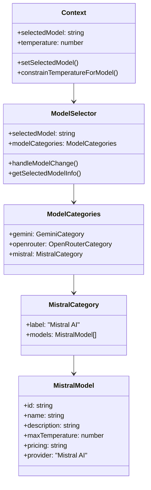
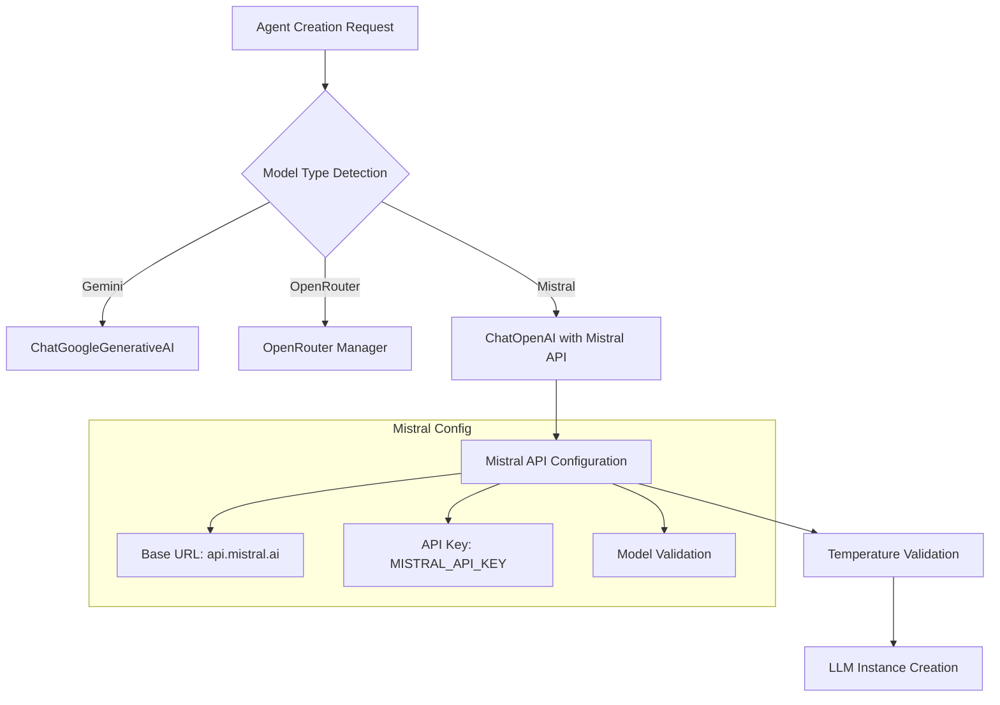
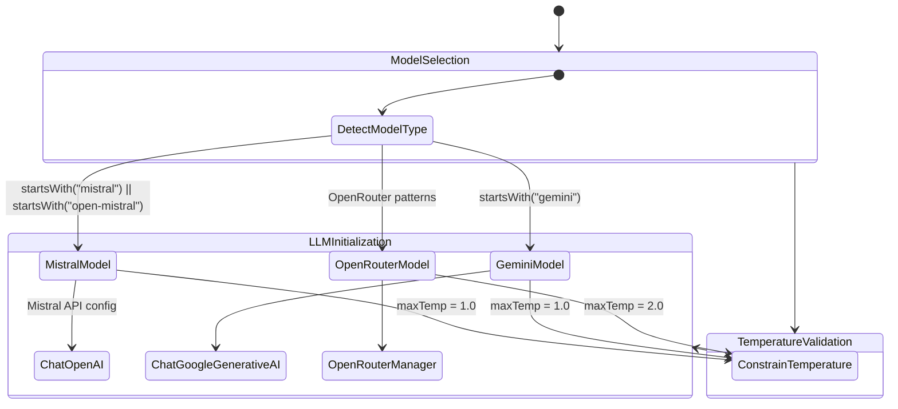

# Mistral Models Integration Design

## Overview

This design outlines the integration of Mistral AI models as a separate category in the existing LLM model selector within the settings panel. The integration will enable direct access to Mistral models using the MISTRAL_API_KEY environment variable, providing users with additional model options alongside the existing Google Gemini and OpenRouter models.

## Technology Stack & Dependencies

### Backend Dependencies
- **LangChain OpenAI Integration**: `langchain_openai.ChatOpenAI` for Mistral API compatibility
- **Environment Management**: `python-dotenv` and `pydantic-settings` for configuration
- **FastAPI**: Existing API framework for handling model selection requests

### Frontend Dependencies  
- **React Context API**: Existing state management for model selection
- **CSS Modules**: Existing styling system for UI components

## Architecture

### Component Architecture

The integration follows the existing model management architecture with the addition of a new Mistral category:



### Backend Architecture

The backend model initialization follows the existing pattern with Mistral-specific configuration:



## Component Definition

### Frontend Model Configuration

The Mistral models will be added as a new category in the `MODEL_CATEGORIES` constant:

| Model ID | Display Name | Description | Max Temperature | Pricing |
|----------|--------------|-------------|----------------|---------|
| `mistral-small` | Mistral Small | Efficient model for most tasks | 1.0 | Standard |
| `mistral-medium` | Mistral Medium | Balanced performance and capability | 1.0 | Standard | 
| `mistral-large` | Mistral Large | Most capable model for complex tasks | 1.0 | Premium |
| `open-mistral-7b` | Open Mistral 7B | Open-source efficient model | 1.0 | Free |
| `open-mixtral-8x7b` | Open Mixtral 8x7B | Open-source mixture of experts | 1.0 | Free |

### Backend Configuration Integration

The backend will extend the existing model detection and initialization logic:

#### Environment Configuration
- Add `MISTRAL_API_KEY` to the Settings class in `config.py`
- Implement Mistral model detection helper function
- Configure API base URL and authentication

#### Agent Integration  
- Extend `create_agent()` function to handle Mistral models
- Add temperature constraints specific to Mistral models (max 1.0)
- Implement error handling for Mistral API connectivity

## State Management

### Context Provider Updates

The existing Context provider will be extended to support Mistral models:



### Model Detection Logic

Helper functions will be implemented to identify Mistral models:

- `isMistralModel(modelId)`: Detect Mistral model patterns
- `getMaxTemperatureForModel(modelId)`: Return appropriate temperature limits
- `constrainTemperatureForModel(temperature, modelId)`: Enforce model-specific constraints

## API Integration Layer

### Mistral API Configuration

The integration will use Mistral's OpenAI-compatible API endpoint:

| Configuration | Value |
|---------------|-------|
| Base URL | `https://api.mistral.ai/v1` |
| Authentication | Bearer token via `MISTRAL_API_KEY` |
| API Format | OpenAI-compatible |
| Streaming Support | Yes |

### Model Initialization Pattern

```javascript
// Mistral model detection and initialization
if (isMistralModel(model)) {
    if (!mistral_api_key) {
        throw new ValueError("MISTRAL_API_KEY environment variable is required for Mistral models");
    }
    
    llm = ChatOpenAI({
        model: model,
        temperature: temperature,
        openai_api_key: mistral_api_key,
        base_url: "https://api.mistral.ai/v1",
        callbacks: callbacks,
    });
}
```

## Configuration Management

### Environment Variables

The configuration system will be extended to support Mistral API key:

```python
class Settings(BaseSettings):
    GOOGLE_API_KEY: str | None = None
    TAVILY_API_KEY: str | None = None  
    OPENROUTER_API_KEY: str | None = None
    MISTRAL_API_KEY: str | None = None  # New addition
```

### Model Category Structure

The frontend model categories will include the new Mistral section:

```javascript
const MODEL_CATEGORIES = {
  gemini: { /* existing Gemini models */ },
  openrouter: { /* existing OpenRouter models */ },
  mistral: {
    label: "Mistral AI",
    models: [
      {
        id: "mistral-small",
        name: "Mistral Small", 
        description: "Efficient model for most tasks",
        maxTemperature: 1.0,
        pricing: "standard",
        provider: "Mistral AI"
      },
      // Additional Mistral models...
    ]
  }
};
```

## Error Handling & Validation

### API Key Validation
- Check for `MISTRAL_API_KEY` presence when Mistral models are selected
- Provide clear error messages for missing or invalid API keys
- Graceful fallback to available models if Mistral is unavailable

### Temperature Constraints
- Enforce maximum temperature of 1.0 for all Mistral models
- Auto-adjust existing temperature settings when switching to Mistral models
- Validate temperature ranges on both frontend and backend

### Model Availability
- Implement model availability checking for Mistral API
- Handle API rate limiting and quota exceeded scenarios
- Provide user-friendly error messages for API failures

## Testing Strategy

### Unit Testing
- Model detection helper functions (`isMistralModel`, `getMaxTemperatureForModel`)
- Temperature constraint validation
- Configuration loading and environment variable handling

### Integration Testing  
- End-to-end model selection flow from frontend to backend
- API key validation and error handling
- Temperature adjustment when switching between model categories

### Component Testing
- ModelSelector component rendering with Mistral category
- Context provider state management for Mistral models
- Settings panel integration and user interaction flows- Implement model availability checking for Mistral API
- Handle API rate limiting and quota exceeded scenarios
- Provide user-friendly error messages for API failures

## Testing Strategy

### Unit Testing
- Model detection helper functions (`isMistralModel`, `getMaxTemperatureForModel`)
- Temperature constraint validation
- Configuration loading and environment variable handling

### Integration Testing  
- End-to-end model selection flow from frontend to backend
- API key validation and error handling
- Temperature adjustment when switching between model categories

### Component Testing
- ModelSelector component rendering with Mistral category
- Context provider state management for Mistral models
- Settings panel integration and user interaction flows


