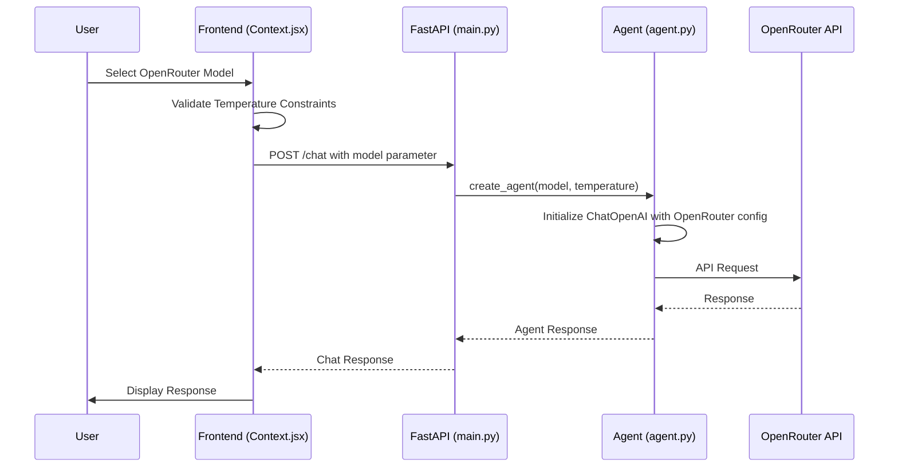
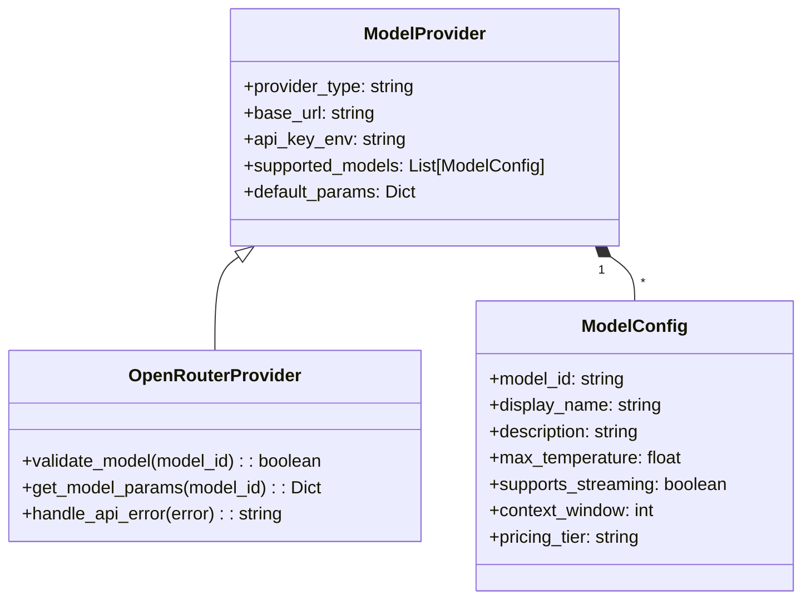
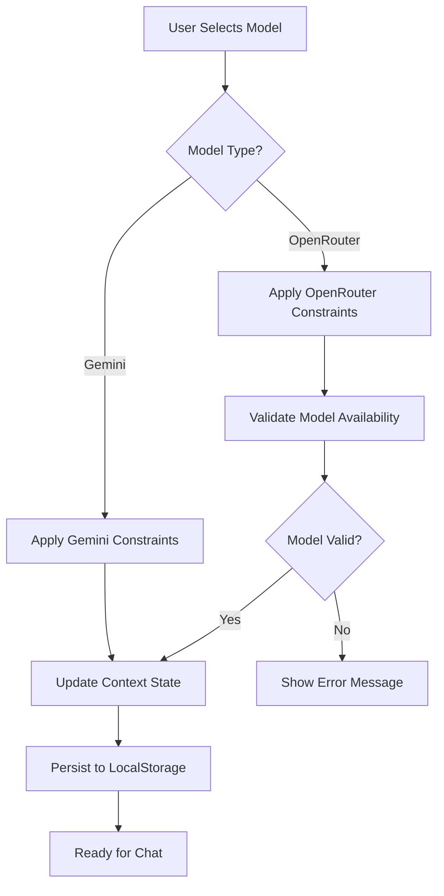
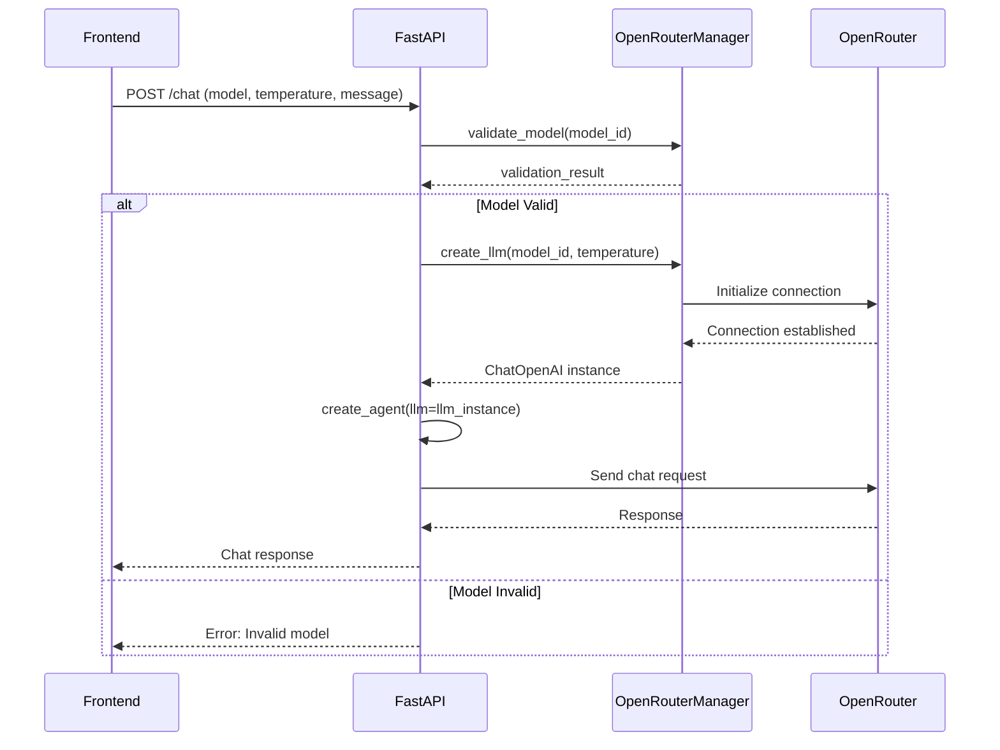

# OpenRouter Model Integration Design

## Overview

This document analyzes the current OpenRouter model integration in the esi-adv application and identifies areas for improvement to ensure robust support for OpenRouter-based LLM models. The frontend provides functionality for selecting different LLM models, including OpenRouter models, but there are several issues in the backend implementation that need to be addressed.

## Technology Stack & Dependencies

### Frontend Components
- **React Context API**: Model selection state management in `Context.jsx`
- **Model Configuration**: Predefined model categories and temperature constraints
- **Local Storage**: Persistent model selection across sessions

### Backend Components
- **FastAPI**: REST API endpoints for chat functionality
- **LangChain**: LLM abstraction layer for different model providers
- **ChatOpenAI**: OpenRouter integration through OpenAI-compatible API
- **Environment Configuration**: Pydantic settings for API key management

## Architecture

### Model Selection Flow



### Component Architecture

```mermaid
graph TB
    subgraph "Frontend Model Management"
        MC[MODEL_CATEGORIES] --> MS[Model Selection State]
        MS --> TC[Temperature Constraints]
        TC --> LS[LocalStorage Persistence]
    end
    
    subgraph "Backend LLM Integration"
        EP[FastAPI Endpoint] --> CA[create_agent()]
        CA --> LLM{Model Type?}
        LLM -->|gemini| CGAI[ChatGoogleGenerativeAI]
        LLM -->|openrouter| COA[ChatOpenAI + OpenRouter]
        COA --> OR[OpenRouter API]
    end
    
    subgraph "Configuration Layer"
        ENV[Environment Variables] --> CONFIG[Pydantic Settings]
        CONFIG --> CA
    end
    
    MS --> EP
```

## Current Implementation Issues

### 1. Model Definition Inconsistencies

**Frontend Model List vs Backend Test**
- Frontend defines: `"mistralai/mistral-small"`, `"mistralai/mistral-large"`
- Backend test uses: `"mistralai/mistral-small-3.2-24b-instruct:free"`

**Issue**: Model IDs in frontend don't match actual OpenRouter model names, causing potential failures.

### 2. Temperature Constraint Logic

**Frontend Implementation**:
```javascript
const getMaxTemperatureForModel = (modelId) => {
  return isGeminiModel(modelId) ? 1.0 : 2.0;
};
```

**Backend Implementation**:
```python
def constrain_temperature_for_model(temperature, model):
    if model and model.startswith("gemini"):
        return max(0.0, min(temperature, 1.0))
    else:
        return max(0.0, min(temperature, 2.0))
```

**Issue**: Assumes all non-Gemini models support temperature up to 2.0, but some OpenRouter models may have different limits.

### 3. OpenRouter Configuration Gaps

**Current Configuration**:
```python
llm = ChatOpenAI(
    model=model,
    temperature=temperature,
    openai_api_key=openrouter_api_key,
    base_url="https://openrouter.ai/api/v1",
    callbacks=None,
)
```

**Missing Elements**:
- Model-specific configuration parameters
- Retry logic for OpenRouter API failures  
- Model capability validation
- Usage tracking and rate limiting

### 4. Error Handling Deficiencies

**Current Error Handling**:
```python
if not openrouter_api_key:
    raise ValueError("OPENROUTER_API_KEY environment variable is required for OpenRouter models")
```

**Missing Scenarios**:
- Invalid model names
- API quota exceeded
- Network connectivity issues
- Model availability status

## Improved Architecture Design

### 1. Enhanced Model Configuration



### 2. Robust Model Selection System

**Frontend Model Registry**:
```javascript
const OPENROUTER_MODELS = {
  "mistralai/mistral-7b-instruct:free": {
    name: "Mistral 7B Instruct",
    description: "Free, efficient instruction-following model",
    maxTemperature: 1.0,
    contextWindow: 32768,
    pricing: "free"
  },
  "mistralai/mistral-small": {
    name: "Mistral Small",
    description: "Efficient, cost-effective model",
    maxTemperature: 1.0,
    contextWindow: 32768,
    pricing: "paid"
  },
  "anthropic/claude-3-5-sonnet": {
    name: "Claude 3.5 Sonnet",
    description: "Advanced reasoning and analysis",
    maxTemperature: 1.0,
    contextWindow: 200000,
    pricing: "premium"
  }
};
```

### 3. Backend Model Management

**Enhanced Agent Creation**:
```python
class OpenRouterModelManager:
    def __init__(self):
        self.model_registry = self._load_model_registry()
    
    def validate_model(self, model_id: str) -> bool:
        return model_id in self.model_registry
    
    def get_model_config(self, model_id: str) -> Dict:
        if not self.validate_model(model_id):
            raise ValueError(f"Unsupported OpenRouter model: {model_id}")
        return self.model_registry[model_id]
    
    def create_llm(self, model_id: str, temperature: float) -> ChatOpenAI:
        config = self.get_model_config(model_id)
        constrained_temp = min(temperature, config["max_temperature"])
        
        return ChatOpenAI(
            model=model_id,
            temperature=constrained_temp,
            openai_api_key=settings.OPENROUTER_API_KEY,
            base_url="https://openrouter.ai/api/v1",
            model_kwargs=config.get("model_kwargs", {}),
            request_timeout=30,
            max_retries=3,
        )
```

### 4. Comprehensive Error Handling

**Error Recovery Strategy**:
```python
class OpenRouterErrorHandler:
    def handle_api_error(self, error: Exception, model_id: str) -> str:
        error_mappings = {
            "invalid_model": f"Model '{model_id}' is not available",
            "quota_exceeded": "API quota exceeded, try again later",
            "rate_limited": "Rate limit exceeded, reducing request frequency",
            "network_error": "Network connectivity issue, retrying..."
        }
        
        error_type = self._classify_error(error)
        return error_mappings.get(error_type, f"OpenRouter API error: {str(error)}")
```

## Data Flow Between Layers

### 1. Model Selection Process



### 2. Chat Request Workflow



## Testing Strategy

### 1. Unit Testing

**Model Configuration Tests**:
```python
def test_openrouter_model_validation():
    manager = OpenRouterModelManager()
    
    # Test valid models
    assert manager.validate_model("mistralai/mistral-7b-instruct:free")
    assert manager.validate_model("anthropic/claude-3-5-sonnet")
    
    # Test invalid models  
    assert not manager.validate_model("invalid/model")
    assert not manager.validate_model("gemini-1.5-pro")  # Wrong provider

def test_temperature_constraints():
    manager = OpenRouterModelManager()
    
    # Test temperature clamping
    llm = manager.create_llm("mistralai/mistral-small", 2.5)
    assert llm.temperature <= 1.0  # Should be clamped to model max
```

### 2. Integration Testing

**End-to-End Model Selection**:
```python
async def test_openrouter_chat_flow():
    # Test complete flow from model selection to response
    request_data = {
        "messages": [{"role": "user", "content": "Hello"}],
        "model": "mistralai/mistral-7b-instruct:free",
        "temperature": 0.7
    }
    
    response = await client.post("/chat", json=request_data)
    assert response.status_code == 200
    assert "text" in response.json()
```

### 3. Error Scenario Testing

**API Failure Handling**:
```python
def test_openrouter_api_failure():
    # Mock API failure
    with patch('openai.ChatCompletion.create') as mock_create:
        mock_create.side_effect = APIError("Rate limit exceeded")
        
        response = chat_with_openrouter_model()
        assert "rate limit" in response["error"].lower()
```

## Implementation Recommendations

### 1. Model Registry Update

**Action**: Update frontend model definitions to match actual OpenRouter model IDs
**Priority**: High
**Impact**: Prevents model initialization failures

### 2. Enhanced Error Handling

**Action**: Implement comprehensive error classification and user-friendly messages
**Priority**: High  
**Impact**: Improves user experience when API issues occur

### 3. Model-Specific Configuration

**Action**: Add model-specific parameters (context windows, capabilities)
**Priority**: Medium
**Impact**: Enables optimal model utilization

### 4. Monitoring and Logging

**Action**: Add detailed logging for OpenRouter API interactions
**Priority**: Medium
**Impact**: Facilitates debugging and usage analysis

### 5. Fallback Mechanism

**Action**: Implement automatic fallback to alternative models when primary choice fails
**Priority**: Low
**Impact**: Increases system reliability

## Configuration Requirements

### Environment Variables

```bash
# Required for OpenRouter functionality
OPENROUTER_API_KEY=your_openrouter_api_key

# Optional configuration
OPENROUTER_TIMEOUT=30
OPENROUTER_MAX_RETRIES=3
OPENROUTER_FALLBACK_MODEL=mistralai/mistral-7b-instruct:free
```

### Model Registry File

**Location**: `server/config/openrouter_models.json`
```json
{
  "models": {
    "mistralai/mistral-7b-instruct:free": {
      "display_name": "Mistral 7B Instruct (Free)",
      "max_temperature": 1.0,
      "context_window": 32768,
      "supports_streaming": true,
      "pricing_tier": "free"
    }
  }
}
```