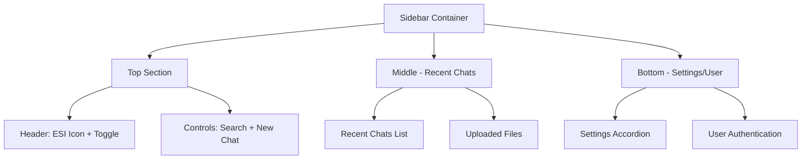
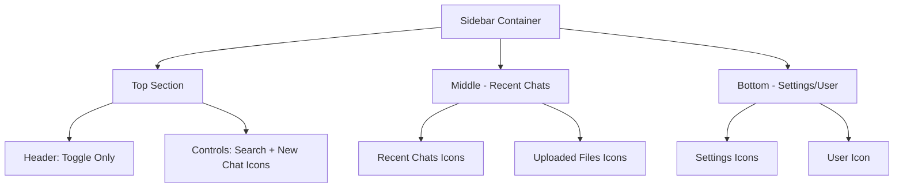

# Sidebar Layout Fix Design

## Problem Statement

The sidebar in the ESI-Adv application has layout issues in both extended and collapsed states:

### Extended State Issues
- Sidebar toggle and ESI icon are not aligned on the same line
- Search box and input elements are misaligned
- Icons lack consistent vertical alignment

### Collapsed State Issues
- ESI icon incorrectly remains visible in sidebar (should only appear in main content)
- Sidebar toggle is improperly positioned
- Search bar is not removed as required
- Icons are not properly vertically aligned

## Solution Design

### Key Changes
1. Restructure the top section to properly align ESI icon and sidebar toggle
2. Position search elements on a dedicated line below the header
3. Conditionally hide ESI icon in collapsed state
4. Reposition sidebar toggle to the left when collapsed
5. Ensure consistent vertical alignment of all icons

## Implementation Plan

### Component Structure Changes

#### Current Structure (Problematic)
```jsx
<div className="top">
  <div className="esi-logo-sidebar" onClick={()=>newChat()}>
    
    <span className="esi-text">esi</span>
  </div>
  <div className="sidebar-toggle">
    <i onClick={() => setExtended(prev => !prev)} className="fi fi-rr-sidebar menu" title="Toggle sidebar" />
  </div>
  <div className="sidebar-icons">
    <div className="search-box">
      <i className="fa-solid fa-search search-icon" onClick={() => !extended && setExtended(true)}></i>
      {extended && (
        <input type="text" placeholder="Search chats..." value={searchQuery} onChange={(e) => setSearchQuery(e.target.value)} className="search-input" />
      )}
    </div>
    <div className="new-chat" onClick={()=>newChat()} title="New chat">
      <i className="fi fi-rr-plus new-chat-icon" />
      {extended && <p>New Chat</p>}
    </div>
  </div>
</div>
```

#### New Structure (Solution)
```jsx
<div className="top">
  <div className="sidebar-header">
    {extended && (
      <div className="esi-logo-sidebar" onClick={()=>newChat()}>
        
        <span className="esi-text">esi</span>
      </div>
    )}
    <div className={`sidebar-toggle ${!extended ? 'left-aligned' : ''}`}>
      <i onClick={() => setExtended(prev => !prev)} className="fi fi-rr-sidebar menu" title="Toggle sidebar" />
    </div>
  </div>
  <div className="sidebar-controls">
    <div className="search-box">
      <i className="fa-solid fa-search search-icon" onClick={() => !extended && setExtended(true)}></i>
      {extended && (
        <input type="text" placeholder="Search chats..." value={searchQuery} onChange={(e) => setSearchQuery(e.target.value)} className="search-input" />
      )}
    </div>
    <div className="new-chat" onClick={()=>newChat()} title="New chat">
      <i className="fi fi-rr-plus new-chat-icon" />
      {extended && <p>New Chat</p>}
    </div>
  </div>
</div>
```

### CSS Implementation

#### New CSS Classes
```css
/* Header container for ESI logo and toggle */
.sidebar-header {
  display: flex;
  justify-content: space-between;
  align-items: center;
  margin-bottom: 20px;
}

/* Controls container for search and new chat */
.sidebar-controls {
  display: flex;
  flex-direction: column;
  gap: 10px;
  margin-bottom: 20px;
}

/* Toggle positioning in collapsed state */
.sidebar.collapsed .sidebar-toggle.left-aligned {
  position: static;
  margin-bottom: 20px;
  margin-left: 0;
}

/* Hide ESI logo in collapsed state */
.sidebar.collapsed .esi-logo-sidebar {
  display: none;
}

/* Ensure proper width in extended state */
.sidebar:not(.collapsed) .search-box {
  width: 100%;
}
```

#### Modified Existing CSS
1. Adjust flex properties for consistent vertical alignment
2. Update padding/margin for uniform spacing
3. Fix absolute positioning of toggle element
4. Ensure proper icon sizing and alignment

## Layout Visualization

### Extended State


### Collapsed State


## Expected Outcomes

### Extended State Results
- ESI icon and sidebar toggle aligned on the same line (right-aligned)
- Search box and input properly aligned on second line
- All icons consistently vertically aligned

### Collapsed State Results
- ESI icon removed from sidebar (appears only in main content)
- Sidebar toggle moved to left and vertically aligned with other icons
- Search bar removed but search icon retained
- All icons properly vertically aligned

## Validation Approach

1. **Visual Testing**
   - Verify element alignment in both states
   - Confirm consistent spacing and positioning
   - Test responsive behavior across screen sizes

2. **Functional Testing**
   - Test toggle functionality between states
   - Verify search functionality preserved
   - Ensure all interactive elements accessible

This solution resolves layout issues while preserving all existing functionality.