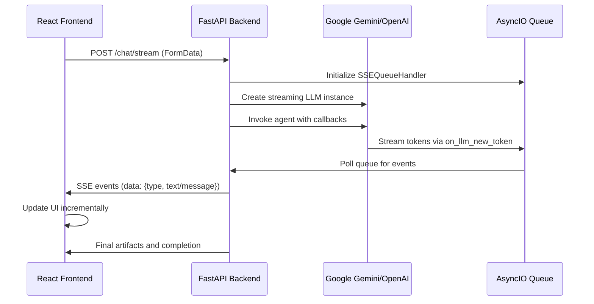
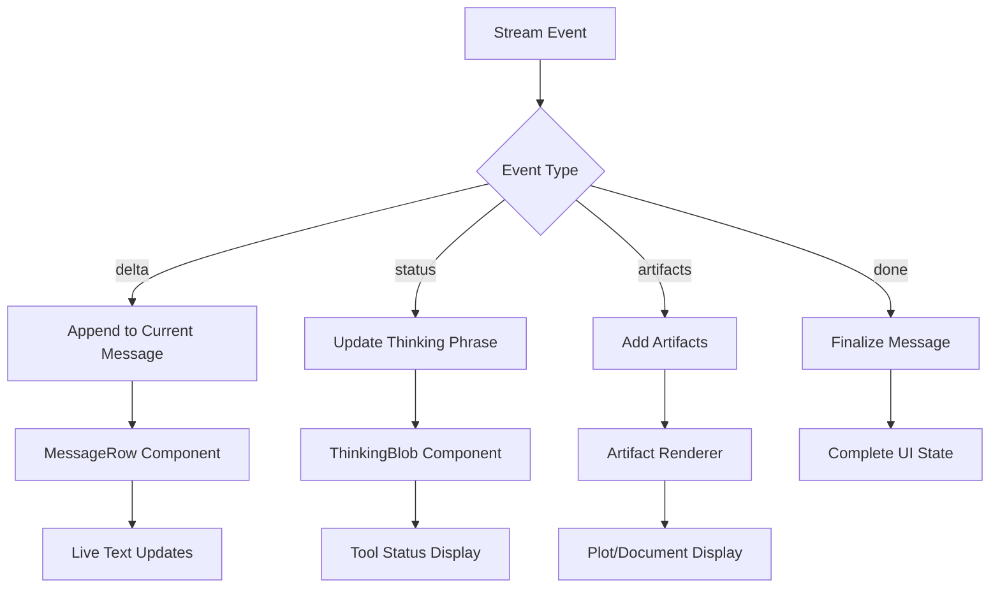

# Streaming Solution Design

## Overview

The esi-adv application is a full-stack AI chat interface that currently supports both streaming and non-streaming responses from LLM models. The streaming infrastructure is already implemented in the backend using Server-Sent Events (SSE) and FastAPI's StreamingResponse, but is currently disabled in the frontend. This design outlines the activation and optimization of real-time streaming capabilities to provide users with immediate, token-by-token response feedback.

## Architecture

### Current Streaming Infrastructure

The application already has a complete streaming pipeline:



### Technology Stack Integration

**Backend Streaming Components:**
- FastAPI StreamingResponse for SSE delivery
- AsyncIO Queue for decoupling token generation from HTTP streaming
- SSEQueueHandler (AsyncCallbackHandler) for LLM token capture
- LangChain agent framework with streaming-capable LLMs

**Frontend Streaming Components:**
- Fetch API with ReadableStream for SSE consumption
- React state management for incremental UI updates
- Message streaming with artifact handling

## Streaming Implementation Details

### Backend Stream Generator Architecture

The backend implements a sophisticated streaming system:

1. **SSEQueueHandler Class**
   - Extends AsyncCallbackHandler to capture LLM events
   - `on_llm_new_token`: Captures individual tokens as they generate
   - `on_tool_start`: Maps tool execution to user-friendly status messages
   - Queues events as JSON for SSE delivery

2. **Stream Generator Function**
   - Initializes async queue and callback handler
   - Creates streaming-capable LLM instances (Gemini/OpenAI)
   - Runs agent invocation in background task
   - Polls queue for events and streams to client
   - Handles completion, errors, and artifact delivery

3. **Event Types**
   - `delta`: Individual token content
   - `status`: Tool execution updates  
   - `artifacts`: File processing results and plots
   - `error`: Error messages
   - `done`: Stream completion signal

### Frontend Streaming Client

The frontend has a complete streaming client implementation:

```javascript
async function streamChatWithHistory(messages, options = {}, file = null, onDelta) {
  const response = await fetch(`${BACKEND_URL}/chat/stream`, {
    method: 'POST',
    body: payload,
  });

  const reader = response.body.getReader();
  const decoder = new TextDecoder();
  let buffer = '';

  while (true) {
    const { done, value } = await reader.read();
    if (done) break;
    
    buffer += decoder.decode(value, { stream: true });
    const lines = buffer.split('\n');
    buffer = lines.pop();

    for (const line of lines) {
      if (line.startsWith('data: ')) {
        const data = JSON.parse(line.slice(6));
        if (onDelta) onDelta(data);
        if (data.type === 'done') return;
      }
    }
  }
}
```

## Activation Strategy

### Current State Analysis

The streaming functionality is **fully implemented but disabled**:
- Backend `/chat/stream` endpoint is functional
- Frontend `streamChatWithHistory` function exists
- Comments indicate "Temporarily use non-streaming endpoint for debugging"

### Activation Steps

1. **Enable Streaming in Context.jsx**
   ```javascript
   // Replace runChatWithHistory with streamChatWithHistory
   await streamChatWithHistory(historyForApi, { verbosity, temperature }, file, onDelta);
   ```

2. **Implement onDelta Handler**
   ```javascript
   const onDelta = (data) => {
     switch (data.type) {
       case 'delta':
         // Append token to current assistant message
         updateCurrentMessage(data.text);
         break;
       case 'status':
         // Update thinking phrase with tool status
         setThinkingPhrase(data.message);
         break;
       case 'artifacts':
         // Add artifacts to current message
         addArtifacts(data.artifacts);
         break;
       case 'done':
         // Finalize streaming and cleanup
         finalizeMessage();
         break;
     }
   };
   ```

3. **Update UI State Management**
   - Modify message state updates for incremental rendering
   - Handle thinking phrase updates during tool execution
   - Manage artifacts arrival during streaming

## Real-Time Streaming vs Pseudo-Streaming

### Real Streaming (Current Implementation)

The application implements **true real-time streaming**:
- **Token-level streaming**: Individual tokens arrive as generated
- **Tool status streaming**: Real-time updates during tool execution
- **Artifact streaming**: File processing results stream incrementally
- **Low latency**: Sub-second response initiation

### Streaming Capabilities by Model

**Google Gemini Models:**
- ✅ Native streaming support via ChatGoogleGenerativeAI
- ✅ Token-by-token generation
- ✅ Tool execution streaming

**OpenAI/OpenRouter Models:**
- ✅ Native streaming support via ChatOpenAI
- ✅ Token-by-token generation  
- ✅ Compatible with OpenRouter proxy

**LangChain Agent Framework:**
- ✅ Full streaming support with callback handlers
- ✅ Tool execution visibility
- ✅ Multi-step reasoning streaming

## UI Enhancement for Streaming

### Message Rendering Components



### Streaming-Optimized Components

1. **MessageRow Enhancement**
   - Progressive text rendering
   - Cursor animation during streaming
   - Artifact placeholder handling

2. **ThinkingBlob Integration**
   - Dynamic phrase updates from tool status
   - Visual indicators for different tool types
   - Smooth transitions between states

3. **Artifact Streaming**
   - Progressive artifact loading
   - Placeholder states during processing
   - Seamless integration with streaming text

## Error Handling and Fallbacks

### Stream Interruption Handling

```javascript
const onDelta = (data) => {
  try {
    handleStreamEvent(data);
  } catch (error) {
    console.error('Stream processing error:', error);
    // Graceful degradation to non-streaming
    fallbackToNonStreaming();
  }
};
```

### Fallback Strategy

1. **Connection Failures**: Automatic retry with exponential backoff
2. **Parsing Errors**: Skip malformed events, continue stream
3. **Timeout Handling**: Stream timeout detection and recovery
4. **Graceful Degradation**: Fall back to non-streaming API if stream fails

### Network Resilience

- **Stream Reconnection**: Automatic reconnection on network interruption
- **State Recovery**: Preserve partial responses during reconnection
- **Bandwidth Adaptation**: Maintain streaming performance on slow connections

## User Experience Enhancements

### Visual Streaming Indicators

1. **Progressive Text Rendering**
   - Character-by-character text appearance
   - Typing cursor animation
   - Smooth text flow

2. **Tool Execution Feedback**
   - Real-time status updates
   - Tool-specific visual indicators
   - Progress indication for long operations

3. **Artifact Streaming**
   - Progressive loading states
   - Smooth transition from text to artifacts
   - Real-time plot rendering

### Performance Optimizations

1. **Message Buffer Management**
   - Efficient string concatenation
   - Memory-conscious message updates
   - DOM update batching

2. **Render Optimization**
   - Virtual scrolling for long conversations
   - Debounced UI updates
   - Selective re-rendering

## Testing Strategy

### Streaming Functionality Tests

1. **Unit Tests**
   - SSE event parsing
   - Message state updates
   - Error handling paths

2. **Integration Tests**
   - End-to-end streaming flow
   - Tool execution streaming
   - Artifact delivery

3. **Performance Tests**
   - Stream latency measurement
   - Memory usage monitoring
   - Connection stability testing

### Test Scenarios

```javascript
describe('Streaming Implementation', () => {
  test('Token streaming updates message incrementally', async () => {
    // Test progressive message building
  });
  
  test('Tool status updates thinking phrase', async () => {
    // Test real-time status updates
  });
  
  test('Stream interruption gracefully fallbacks', async () => {
    // Test error recovery
  });
});
```